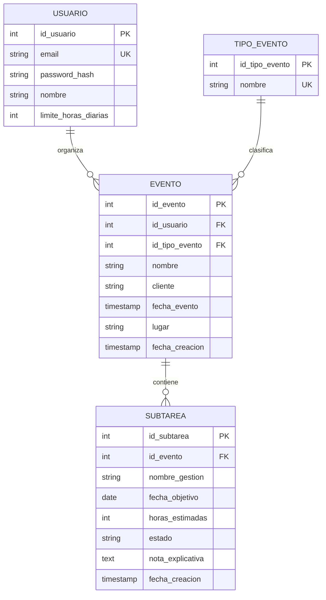

# Arquitectura — Planificador de Eventos

**Versión:** 1.0 · **Fecha:** 2026-09-24 · **Alcance:** frontend React/Vite, backend Spring Boot y persistencia PostgreSQL/Supabase

## 1. Vista general

El sistema está compuesto por dos aplicaciones independientes:

1. **Frontend SPA:** React 19 + Vite 8 + React Router 7 + Tailwind CSS 4.
2. **Backend API:** Spring Boot 4.1.1 + Java 21 + Maven.
3. **Base de datos:** PostgreSQL administrado en Supabase, con JPA/Hibernate.
4. **Despliegue:** frontend en Vercel y backend como servicio web Docker en Render.

El proyecto no utiliza microservicios. La arquitectura es por capas y ambos componentes se despliegan como aplicaciones independientes.

## 2. Diagrama de flujo

```mermaid
flowchart LR
    U[Organizador] --> V[Vercel / React SPA]
    V -->|HTTPS + JSON| C[CORS /api]
    C --> S[Spring Boot REST API]
    S --> B[Service]
    B --> R[Spring Data JPA Repository]
    R --> P[(Supabase PostgreSQL)]
    S --> D[Swagger / OpenAPI]
    S --> H[/api/health]
```

## 3. Patrón arquitectónico

### Frontend

- **Presentación:** `pages/` y componentes `ui/`.
- **Vistas de negocio:** `views/CreateEventView.jsx` y `views/EventDetailView.jsx`.
- **Estados visuales:** `components/states/`.
- **Acceso a datos:** `services/api.js`.
- **Navegación:** `routes/AppRoutes.jsx` bajo `Layout` y `Outlet`.

### Backend

- **Controller:** expone HTTP y valida DTOs.
- **Service:** reglas de negocio y transacciones.
- **Repository:** persistencia mediante Spring Data JPA.
- **Model:** entidades JPA y DTOs.
- **Exception:** errores de negocio y manejo global de respuestas.

### Base de datos

- `tipo_evento`: catálogo de tipos.
- `usuario`: organizador y límite horario.
- `evento`: datos principales de un evento.
- `subtarea`: tareas logísticas que pertenecen a un evento.

La base se define mediante `db/ddl-supabase.sql`. `spring.jpa.hibernate.ddl-auto=validate`; Hibernate nunca modifica automáticamente el esquema compartido.

## 4. Estructura del frontend

```text
src/
├── main.jsx
├── App.jsx
├── routes/AppRoutes.jsx
├── pages/
│   ├── HoyPage.jsx
│   ├── CrearPage.jsx
│   ├── DetallePage.jsx
│   ├── ProgresoPage.jsx
│   └── LoginPage.jsx
├── views/
│   ├── CreateEventView.jsx
│   └── EventDetailView.jsx
├── components/
│   ├── states/
│   └── ui/
├── services/api.js
└── index.css
```

Responsabilidades:

- `App.jsx` monta el enrutador.
- `AppRoutes.jsx` registra rutas, redirecciones y carga inicial.
- `Layout.jsx` mantiene la barra lateral, la navegación responsive y `Outlet`.
- `Card.jsx` y `Badge.jsx` concentran la superficie y los estados visuales reutilizables de las tarjetas.
- `api.js` centraliza URL, cabeceras, errores y mapeo de fechas.
- `EventDetailView.jsx` coordina lectura, edición, subtareas, progreso y eliminación.

## 5. Estructura del backend

```text
src/main/java/uv/isj/planificadoreventosbackend/
├── controller/
│   ├── HealthController.java
│   ├── EventoController.java
│   ├── SubtareaController.java
│   └── TipoEventoController.java
├── service/
│   ├── HealthService.java
│   ├── EventoService.java
│   ├── SubtareaService.java
│   └── TipoEventoService.java
├── repository/
│   ├── EventoRepository.java
│   ├── SubtareaRepository.java
│   ├── UsuarioRepository.java
│   └── TipoEventoRepository.java
├── model/
│   ├── Evento.java
│   ├── Subtarea.java
│   ├── Usuario.java
│   ├── TipoEvento.java
│   ├── EstadoSubtarea.java
│   └── dto/
└── exception/
    ├── RecursoNoEncontradoException.java
    └── GlobalExceptionHandler.java
```

## 6. Contrato HTTP

| Método   | Endpoint                          | Propósito                            |
| -------- | --------------------------------- | ------------------------------------ |
| `GET`    | `/api/health`                     | Estado de aplicación y base de datos |
| `GET`    | `/api/tipos-evento`               | Catálogo de tipos de evento          |
| `GET`    | `/api/eventos?usuarioId={id}`     | Lista eventos del organizador        |
| `GET`    | `/api/eventos/{id}`               | Obtiene un evento                    |
| `GET`    | `/api/eventos/{id}/subtareas`     | Lista subtareas de un evento         |
| `GET`    | `/api/subtareas/hoy?usuarioId={id}&fecha={yyyy-MM-dd}` | Lista gestiones no ejecutadas para hoy |
| `POST`   | `/api/eventos`                    | Crea un evento                       |
| `PUT`    | `/api/eventos/{id}`               | Actualiza un evento                  |
| `DELETE` | `/api/eventos/{id}`               | Elimina un evento                    |
| `POST`   | `/api/eventos/{id}/subtareas`     | Crea una subtarea                    |
| `GET`    | `/api/subtareas?eventoId={id}`    | Lista subtareas de un evento         |
| `GET`    | `/api/subtareas/{id}`             | Obtiene una subtarea                 |
| `PUT`    | `/api/subtareas/{id}`             | Actualiza los datos de una subtarea  |
| `PATCH`  | `/api/subtareas/{id}/estado`      | Cambia el estado de una subtarea     |
| `PATCH`  | `/api/subtareas/{id}/reprogramar` | Reprograma y evalúa el límite diario |
| `DELETE` | `/api/subtareas/{id}`             | Elimina una subtarea                 |
| `GET`    | `/swagger-ui.html`                | Documentación interactiva            |
| `GET`    | `/v3/api-docs`                    | Especificación OpenAPI               |

El endpoint de estado acepta `pendiente` para reabrir una subtarea, además de `ejecutada` y `pospuesta`.

### DTOs

#### EventoDTO

```text
idEvento
idUsuario
idTipoEvento
nombre
cliente
fechaEvento (LocalDateTime)
lugar
fechaCreacion
```

#### TipoEventoDTO

```text
idTipoEvento
nombre
```

#### SubtareaDTO

```text
idSubtarea
idEvento
nombreGestion
fechaObjetivo (LocalDate)
horasEstimadas (mínimo 1)
estado (pendiente | ejecutada | pospuesta)
notaExplicativa
fechaCreacion
```

#### SubtareaActualizacionDTO

```text
nombreGestion
fechaObjetivo (LocalDate)
horasEstimadas (mínimo 1)
```

## 7. Flujo de datos

### Crear evento

1. La persona completa `CreateEventView`.
2. El frontend valida los campos requeridos.
3. `api.createEvent` envía `POST /api/eventos` con el DTO en español.
4. `EventoController` valida el cuerpo.
5. El controller resuelve `Usuario` y `TipoEvento` por sus IDs.
6. `EventoService` persiste mediante `EventoRepository`.
7. El backend responde con el DTO persistido.
8. El frontend obtiene `idEvento` y navega a `/evento/:id`.

### Consultar detalle

1. React Router entrega `id` a `EventDetailView`.
2. El frontend solicita evento y subtareas en paralelo.
3. El backend consulta JPA y devuelve DTOs.
4. La vista normaliza los nombres de la respuesta para soportar el contrato español.
5. Se muestra loading, error con reintento o contenido.

### Consultar la vista Hoy

1. `HoyPage` obtiene la fecha local del organizador.
2. El frontend consulta `GET /api/subtareas/hoy` con `usuarioId` y `fecha`.
3. El backend filtra por fecha objetivo y excluye las gestiones ejecutadas.
4. La vista cruza los `idEvento` con la lista de eventos para mostrar el nombre y permite abrir el detalle.
5. Se muestran estados de carga, error con reintento y vacío con una acción para crear un evento.

### Actualizar/eliminar subtarea

1. La persona edita los campos de una subtarea, la completa/reabre o solicita eliminarla.
2. El frontend envía `PUT` a `/api/subtareas/{id}`, `PATCH` a `/api/subtareas/{id}/estado` o `DELETE` a `/api/subtareas/{id}`.
3. El controller busca el recurso y mapea el DTO.
4. El service aplica la transacción.
5. La vista solo actualiza el estado local después de recibir un DTO persistido del servidor.

### Eliminar un evento

1. La persona abre el modal de confirmación desde el detalle del evento.
2. El frontend envía `DELETE /api/eventos/{id}`.
3. El backend elimina el evento y sus subtareas mediante la relación JPA con cascada y la restricción `ON DELETE CASCADE` de PostgreSQL.
4. Tras recibir `204`, la vista vuelve al listado de progreso y la tarjeta eliminada deja de aparecer.

## 8. Modelo de entidades



Reglas:

- Un evento pertenece a un usuario y a un tipo de evento.
- Un evento puede tener muchas subtareas.
- Al eliminar un evento, la base aplica `ON DELETE CASCADE` sobre sus subtareas.
- Las horas deben ser mayores que cero.
- Los estados permitidos son `pendiente`, `ejecutada` y `pospuesta`.

## 9. Configuración y despliegue

### Frontend

```text
VITE_API_URL=http://localhost:8080
VITE_USER_ID=1
```

`VITE_USER_ID` es temporal hasta implementar autenticación. Nunca deben incluirse contraseñas, tokens o secretos en variables `VITE_*`.

### Backend

Variables requeridas:

```text
DB_URL
DB_USER
DB_PASSWORD
```

- Desarrollo local: conexión directa o pooler según disponibilidad IPv4/IPv6.
- Render: pooler transaccional de Supabase.
- CORS: Vercel y `http://localhost:5173` permitidos en `application.properties`.
- Health check: `/api/health`.
- Render usa `main`; los cambios de `backend/lead` requieren merge.

## 10. Seguridad y validación

- DTOs con Jakarta Validation en backend.
- Errores 400 para payloads inválidos.
- Errores 404 para recursos inexistentes.
- CORS restringido a orígenes configurados.
- No se almacenan secretos en el frontend.
- La autenticación JWT todavía está fuera de alcance.
- `VITE_USER_ID` debe eliminarse cuando exista la US-11.

## 11. Pruebas y calidad

Frontend:

```bash
npm run lint
npm run build
npx prettier --check <archivos>
```

Backend:

```bash
./mvnw test
./mvnw package
```

La prueba de API usa MockMvc y H2 con perfil `test`. La validación end-to-end con Supabase y el despliegue real deben ejecutarse en los entornos configurados.

## 12. Dependencias y próximos pasos

1. Fusionar `backend/lead` en `main` mediante el flujo del coordinador.
2. Configurar `DB_URL`, `DB_USER` y `DB_PASSWORD` en Render.
3. Configurar `VITE_API_URL` en Vercel.
4. Ejecutar una prueba end-to-end con datos reales.
5. Implementar autenticación y reemplazar `VITE_USER_ID`.
6. Ejecutar Lighthouse/axe y pruebas con lector de pantalla sobre el despliegue.

## 13. Referencias

- Requerimientos: `PRD.md`.
- Sistema visual: `DESIGN_SYSTEM.md`.
- Decisiones UX: `docs/decisiones-ux.md`.
- Microcopy: `docs/guia-microcopy.md`.
- Accesibilidad: `docs/auditoria-a11y.md`.
- Bóveda del frontend: `boveda/`.
- Bóveda del backend: `planificador-eventos-backend/boveda/`.
